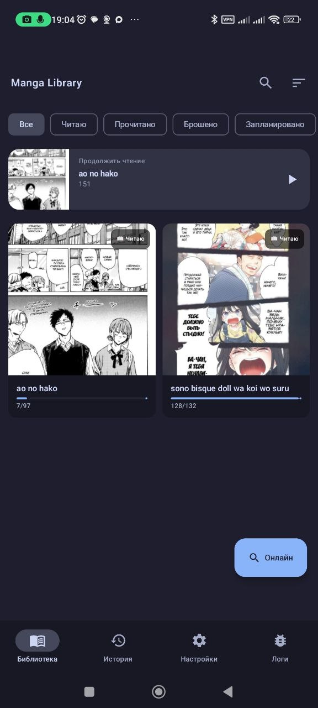
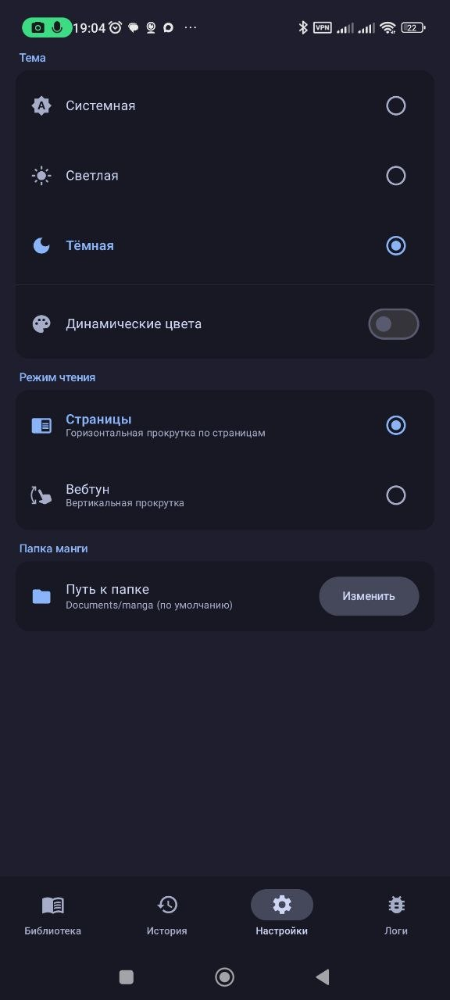

<div align="center">


<br/>


<br/>

> **Android-приложение для чтения манги с интеграцией Mangalib.**
> Поиск, чтение, закладки, загрузка офлайн — всё в одном месте.

</div>

---

## Экраны

| Экран | Описание |
|-------|----------|
| **Поиск** | Поиск манги по базе Mangalib с мгновенными результатами |
| **Библиотека** | Локальная коллекция скачанной манги |
| **Детали** | Описание, обложка, список глав |
| **Ридер** | Горизонтальный и вертикальный скроллинг с настраиваемым поведением |
| **Загрузки** | Менеджер офлайн-загрузок глав |
| **Закладки** | Сохранённые тайтлы для быстрого доступа |
| **История** | Журнал прочитанного с прогрессом |
| **Настройки** | Тема, поведение ридера, логи |
| **Логи** | Встроенный логгер для отладки |

---

## Скриншоты

<div align="center">

<table>
<tr>
<td align="center">

<br/><b>Библиотека</b>
</td>
<td align="center">

<br/><b>Информация о манге</b>
</td>
<td align="center">

<br/><b>Настройки</b>
</td>
</tr>
</table>

</div>

---

## Архитектура

```
┌──────────────────────────────────────────────────────┐
│                    UI (Compose)                       │
│  Screens → ViewModels → Theme / Components           │
├──────────────────────────────────────────────────────┤
│                    Data Layer                         │
│  MangalibApi → Repository → Store                    │
│  Room DB ← ProgressDao ← Entities                    │
│  DataStore (ThemePreferences)                        │
├──────────────────────────────────────────────────────┤
│                  System                              │
│  DownloadManager · FileObserver · LogCollector       │
│  Coil ImageLoader (memory + disk cache)              │
└──────────────────────────────────────────────────────┘
```

---

## Стек технологий

| Компонент | Технология |
|-----------|-----------|
| **Язык** | Kotlin 2.0 |
| **UI** | Jetpack Compose + Material 3 |
| **Навигация** | Navigation Compose 2.8 |
| **Сеть** | OkHttp 4 + kotlinx.serialization |
| **БД** | Room 2.6 (KSP) |
| **Хранение настроек** | DataStore Preferences |
| **Загрузка изображений** | Coil 2.7 (memory + 200MB disk cache) |
| **Логирование** | Timber + кастомный LogCollector |
| **Сборка** | Gradle (Version Catalog) |

---

## Зависимости

<details>
<summary><b>Core</b></summary>

- `androidx.core:core-ktx` 1.15.0
- `androidx.lifecycle:lifecycle-runtime-ktx` 2.8.7
- `androidx.lifecycle:lifecycle-viewmodel-compose` 2.8.7
- `androidx.activity:activity-compose` 1.9.3

</details>

<details>
<summary><b>Compose</b></summary>

- Compose BOM 2024.12.01
- Material 3, Material Icons Extended
- Foundation, Animation, UI Graphics
- Navigation Compose 2.8.5

</details>

<details>
<summary><b>Data</b></summary>

- Room 2.6.1 (runtime + ktx + compiler via KSP)
- DataStore Preferences 1.1.1
- OkHttp 4.12.0
- kotlinx-serialization-json 1.7.3

</details>

<details>
<summary><b>Image Loading</b></summary>

- Coil Compose 2.7.0
- Memory cache: 25% of app memory
- Disk cache: 200 MB

</details>

---

## Структура проекта

```
app/src/main/java/com/mangareader/
├── MainActivity.kt
├── MangaReaderApp.kt          # Application, Coil init, Timber
├── data/
│   ├── MangaRepository.kt     # Бизнес-логика
│   ├── MangaStore.kt          # Хранилище данных
│   ├── MangaFileObserver.kt   # Отслеживание файловой системы
│   ├── ThemePreferences.kt    # Настройки темы (DataStore)
│   ├── db/
│   │   ├── AppDatabase.kt     # Room database
│   │   ├── Entities.kt        # Таблицы
│   │   └── ProgressDao.kt     # DAO для прогресса чтения
│   └── network/
│       ├── MangalibApi.kt     # API Mangalib
│       ├── DownloadManager.kt # Загрузка глав
│       └── LogCollector.kt    # Сбор логов
└── ui/
    ├── NavHost.kt             # Навигация
    ├── components/
    │   ├── EmptyState.kt
    │   └── ShimmerEffect.kt
    ├── screens/
    │   ├── SearchScreen.kt
    │   ├── LibraryScreen.kt
    │   ├── MangaDetailsScreen.kt
    │   ├── ChapterListScreen.kt
    │   ├── ReaderScreen.kt
    │   ├── DownloadScreen.kt
    │   ├── BookmarksScreen.kt
    │   ├── HistoryScreen.kt
    │   ├── SettingsScreen.kt
    │   ├── LogsScreen.kt
    │   └── ReaderSettingsSheet.kt
    ├── theme/
    │   ├── Color.kt
    │   ├── Theme.kt
    │   ├── Type.kt
    │   └── Shapes.kt
    └── viewmodel/
        ├── LibraryViewModel.kt
        └── DownloadViewModel.kt
```

---

## Сборка

### Требования

- Android Studio Hedgehog+ (Gradle 8.7 / AGP 8.7)
- JDK 17
- Android SDK 35
- Kotlin 2.0.21

### Сборка APK

```bash
# Debug
./gradlew assembleDebug

# Release (потребуется keystore)
./gradlew assembleRelease
```

### Запуск

```bash
# Установить на устройство
./gradlew installDebug
```

---

## Конфигурация

| Параметр | Значение |
|----------|---------|
| `applicationId` | `com.mangareader` |
| `minSdk` | 26 (Android 8.0) |
| `targetSdk` | 35 (Android 15) |
| `compileSdk` | 35 |
| `versionCode` | 1 |
| `versionName` | 1.0 |
| JVM Target | 17 |

### Разрешения

- `INTERNET` — загрузка манги и обложек
- `READ_EXTERNAL_STORAGE` — чтение скачанных файлов
- `READ_MEDIA_IMAGES` — доступ к изображениям (Android 13+)

---


<div align="center">
<sub>Made with ❤️ by <a href="https://github.com/EggZys">EggZys</a></sub>
</div>
